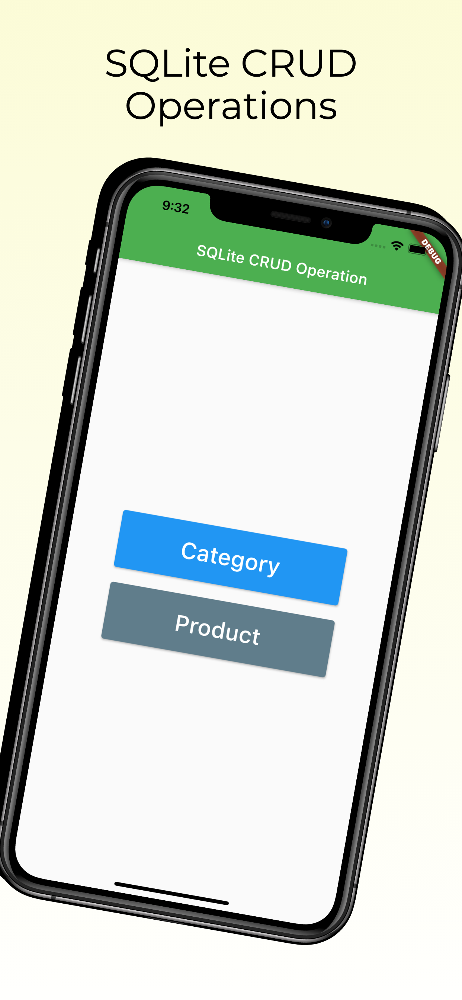
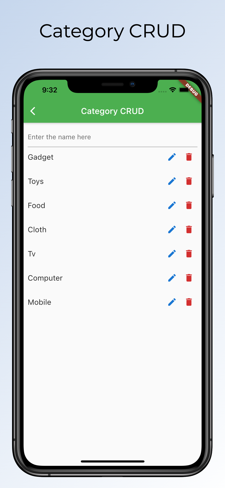
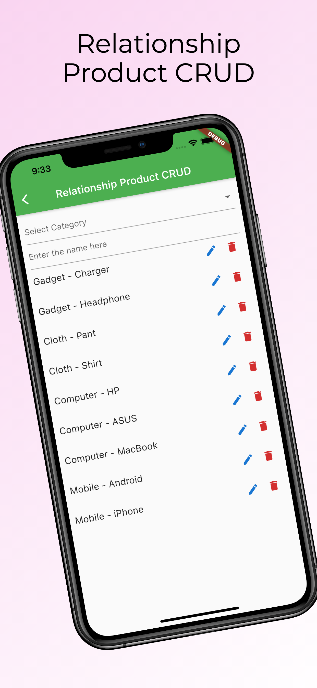

# Introduction
In this project, I have done a simple CRUD operation using <b>sqlite</b> and <b>sqflite</b>

# SQLite
In mobile app SQLite is a local databse, which we can access without internet. When we want to create a complex project without internet then SQLite will be the best options. It store data in our phons locally.

# sqflite
It is flutter plugin to access SQLite database. It gives Raw SQL queries option and some awesome SQL helpers to handle SQLite database very easily.

# Project Screenshot 
  

# Find Me On
- Facebook: https://www.facebook.com/airocky88
- YouTube: https://www.youtube.com/channel/UCQI7jQR6xmgFDI2gqjGL7_A
- Website: https://sarocky.com